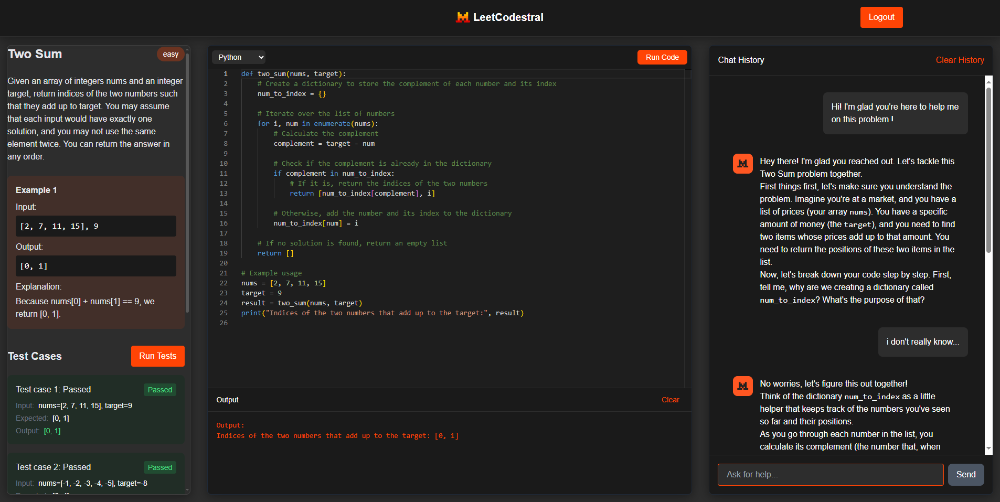

# LeetCode Assistant



An interactive coding platform that helps you learn and practice coding.

## Features

- 🤖 AI-powered coding assistant that provides contextual help
- 💻 Interactive code editor with syntax highlighting
- ✅ Automated test case generation and validation
- 🗣️ Chat interface with conversation history
- 🔒 User authentication system
- 📈 Progressive problem difficulty

## How It Works

### Problem Description Panel

When the user arrives on the page, the problem description panel is initially empty. The problem description is AI-generated using the Mistral AI API with the `mistral-large-latest` model in JSON mode. Once the problem is generated, it is displayed in the panel.

### Running Tests

The "Run Tests" button will work if the function name in the code matches the problem title in snake_case. This ensures that the tests are executed against the correct function.

### AI Assistant Chatbot

The chatbot serves as an AI assistant, providing help related to the user's code. Each time the user makes a request, their code is copied into the prompt and sent to the AI model. This allows the AI to provide context-aware assistance.

### Test Results

When tests are run, the results are also sent in the prompt to the AI model. This provides better context for the AI to offer more accurate and helpful suggestions.

### Success

If all tests passed, a dialog box appears and suggests to go to the next problem or stay on the current problem.
PS: for now these two buttons hide the dialog box. I'd like to implement a database to store problems, but haven't managed to know how to practically do it.

### Moderation

The chatbot uses mistral's moderation api. It the api finds a problem in the user's request, the violation rule tag is sent to the chat api and it returns a streamed response explaining why there was a problem with the question.

## Tech Stack

### Frontend

- Next.js 13+ with App Router
- TypeScript
- TailwindCSS
- CodeMirror for code editing
- React Markdown for chat rendering

### Backend

- FastAPI
- SQLAlchemy
- Mistral AI API
- JWT Authentication
- SQLite Database

## Getting Started

### Prerequisites

- Node.js 16+
- Python 3.8+
- Mistral AI API key
- Environment variables setup

### Installation

1. **Clone the repository**

    ```bash
    git clone https://github.com/jaccolor2/LeetCodestral.git
    cd LeetCodestral
    ```

2. **Set up a virtual environment for the backend**

    ```bash
    cd leetcode-assistant/backend
    python -m venv venv
    source venv/bin/activate  # On Windows use `venv\Scripts\activate`
    ```

3. **Install backend dependencies**

    ```bash
    pip install -r requirements.txt
    python init_db.py
    ```

4. **Create a `.env` file in the backend directory:**

    ```env
    MISTRAL_API_KEY=your_mistral_api_key
    ```

5. **Install frontend dependencies**

    ```bash
    cd ../frontend
    npm install
    ```

### Running the Application

1. **Start the backend server**

    ```bash
    cd backend
    uvicorn main:app --reload
    ```

2. **Start the frontend development server**

    ```bash
    cd frontend
    npm run dev
    ```

3. **Open [http://localhost:3000](http://localhost:3000) in your browser**

## Features in Detail

### AI Assistant

- Contextual help based on the current problem
- Code analysis and suggestions
- Progressive hints without giving away solutions
- Conversation memory for better assistance

### Code Execution

- Safe code execution environment
- Real-time test case validation
- Automated test case generation
- Performance analysis

### User Interface

- Split-panel interface for problem description, code editor, and chat
- Responsive design
- Dark mode optimized
- Real-time code validation

## Contributing

1. Fork the repository
2. Create your feature branch (`git checkout -b feature/AmazingFeature`)
3. Commit your changes (`git commit -m 'Add some AmazingFeature'`)
4. Push to the branch (`git push origin feature/AmazingFeature`)
5. Open a Pull Request

